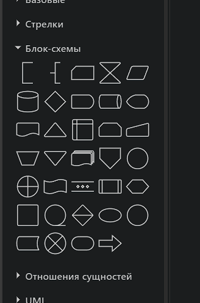
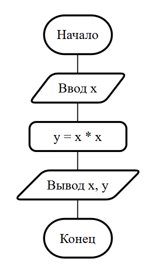
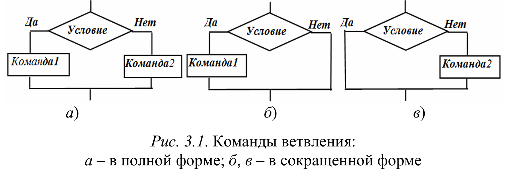
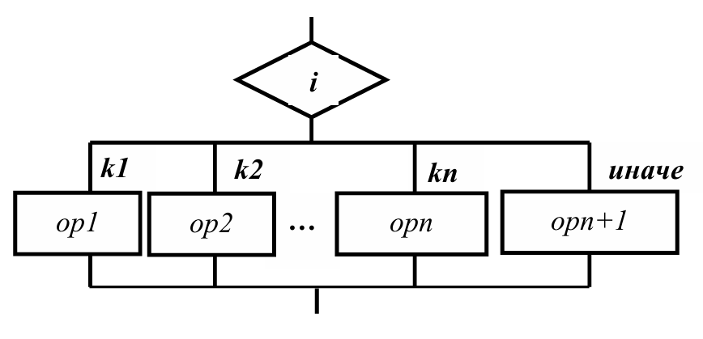
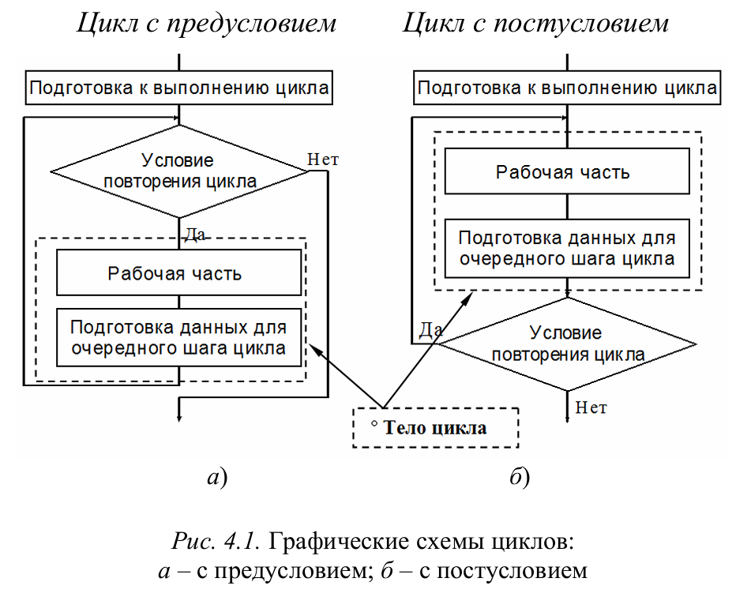
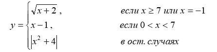

## Основы алгоритмизации и программирования

### Требования к л.р.

#### Оформление отчета
Начиная с л.р. №3 **отчеты** необходимо **оформлять согласно требований**. Методические указания по оформлению отчета находятся на учебном портале в курсе ОАиП в файле **"Оформление отчета"** (раздел "Общее").

Текст программ помещаем в одно приложение - **Приложение А**. Перед текстом каждой программы подписать к какому заданию он относится (в файле **Оформление отчета** есть пример).

#### Блок-схемы
**Блок-схемы** можно составлять в https://app.diagrams.net/. Элементы для нее находятся в соответствующей вкладке - "Блок-схемы", линии для соединения - во вкладке "Общие".

<p align="center">
  
</p>

**Шрифт текста** на блок-схемах: *Times New Roman*, размер: 14 пт.

**Блок-схемы** составляем для следующих л.р.:
- л.р. №3: для всех заданий
- л.р. №4: задания 4.1, 4.3, 4.6, 4.7
- л.р. №5: задания 5.1, 5.2, 5.3, 5.5
- л.р. №6: задание 1(2)
- л.р. №7: задание 7.1, 7.3, 7.5, 7.6

Блок-схемы должны быть выполнены на белом фоне. В **отчете** блок-схемы помещаем в **Приложение Б** (название: Блок-схемы). Также они должны быть представлены в адекватном виде: выровнены, с одинаковыми отступами между элементами и т.д., иначе будем учиться рисовать их ручками в тетради.

Пример блок-схемы:
<p align="center">
  
</p>

Блок-схемы для ветвлений (if-else):
<p align="center">
  
</p>

Блок-схемы для ветвлений (switch):
<p align="center">
  
</p>

Блок-схемы для циклов:
<p align="center">
  
</p>

#### Тестирование и верификация

Тестирование программы - это важный этап разработки, позволяющий убедиться, что разработанная программа работает правильно для всех предусмотренных случаев. Даже если программа успешно компилируется, это не гарантирует ее корректность: ошибки могут проявляться только при определенных входных данных. Поэтому тестирование помогает выявить неточности в логике, проверить граничные условия и убедиться, что программа выдает ожидаемый результат.

Для выполнения тестирования Вам необходимо:
- составить таблицу тестов с двумя столбцами: входные данные и ожидаемый результат
- заполнить таблицу данными для тестирования, при этом необходимо учитывать все возможные варианты входных данных
- запустить программу несколько раз для каждого тестового набора входных данных. Сравнить полученный вывод программы с ожидаемым

Например, есть следующая задача: вычислить значение функции, заданное формулой:

<p align="center">
  
</p>

Входными данными в этой задаче является переменная `x`. Тесты необходимо составить для случаев:
- если `x` больше или равен 7
- если `x` равен -1
- если `x` находится в диапазоне (0;7)
- если `x` не удолетворяет ни одному из вышеперечисленных условий, т.е. `x` меньше или равен 0

Таким образом, тесты для этой задачи следующие:

| Входные данные | Ожидаемый результат |
| -------------- | ------------------- |
| 7              | 3                   |
| 10             | 3.464               |
| -1             | 1                   |
| 5              | 4                   |
| 0              | 4                   |
| -13            | 173                 |

Для л.р. №4 составляем тесты для любых 3-х программ. Далее, начиная с л.р. №5, составляем тесты для всех программ.

#### Немного про циклы

Есть два способа создания цикла: с помощью оператора `for` и `while`. Выбор оператора цикла зависит от наличия условия преждевременного выхода из цикла.

Например, если необходимо пройтись в цикле от начала до конца, то используется оператор `for`:

```C
float x_start = 0.0f;
float x_end   = 15.3f;
float step    = 0.1f;

float y       = 0.0;

for (int x = x_start; x_start <= x_end; x += step) {
    y = x * 2;
    printf("y(%.3f) = %.3f", x, y);
}
```

А если также необходимо пройтись в цикле от начала до конца, но при этом есть условие преждевременного выхода из цикла, то используется оператор `while`:

```C
char stop   = 0;

float x     = 0.0f;
float x_end = 10.0f;
float step  = 0.1f;

const float TRESHOLD = 7.3f;

scanf("%f", &step);

while (x <= x_end && !stop) {
    if (x > TRESHOLD) {
	    stop = 1;
	}

	x += step;
}

if (stop) {
    printf("x has reached on value %.3f", x);
} else {
    printf("x has not reached the threshold");
}
```

Операторы `break` и `goto` использовать **ЗАПРЕЩЕНО**, т.к. они ухудшают читаемость кода. 

### Советы по разработке программ

#### Этапы разработки простых программ
1. Прочитайте техническое задание. Основа любой программы: данные и алгоритмы обработки этих данных, поэтому определите в задании какие есть данные и каким образом их необходимо обработать.
2. Составьте список переменных, определите их тип, спецификатор ввода/вывода и диапазон допустимых значений.
3. Составьте блок-схему программы (можно упрощенную, чтобы Вы учились планировать структуру программы, это очень важно).
4. Составьте тесты, охватывающие все возможные сценарии ввода данных.
5. Реализуйте программу согласно блок-схемы.
6. Выполните отладку программы используя подготовленные тесты.

#### Требования к написанию программ
- ввод/вывод должен быть с сопроводительным текстом
	- например, текст при вводе данных: "Input a number of bunnies: "
	- например, текст при выводе данных (`10` - значение переменной): "There are `10` bunnies in total"
- название переменной должно описывать назначение этой переменной
	- никаких a, b, c - в названии должен быть отражен смысл (кроме итераторов и математических формул). Самодокументируемый код - очень хорошая практика
	- например, переменная, которая хранит размер массива, должна быть названа: `array_size`
	- в случае, если описать назначение переменной через ее имя трудно, то назначение этой переменной должно быть описано комментарием
	- названия переменных записываются в нижнем регистре, а слова в названиях отделяются нижним подчеркиванием
	
```C
int my_int_variable = 0;
char *hello_str = "hello";
pid_t current_pid = fork();
```

- логически разделяйте код пустыми строками

```C
#include <stdio.h>
#include <stdlib.h>

int main() {
    // здесь объявляем переменные
    const int array_size = 15;
    int* array = malloc(sizeof(int) * array_size);

    // здесь обрабатываем данные в массиве
    for (int i = 0; i < array_size; ++i) {
        array[i] = i * 2;
    }

    // здесь выводит элемент массива
    printf("%d", array[5]);

    return 0;
}
```

- описывайте код комментариями
	- пока Вы еще изучаете основы, желательно комментировать все, что для Вас в новинку, чтобы лучше запоминалось (особенно необходимо комментировать используемые функции: что они делают, какие входные параметры, что возвращают)
- i, j, k - стандартные названия для итераторов цикла

```C
int array[MAX_ARRAY_SIZE] = arrinit();

for (int i = 0; i < MAX_ARRAY_SIZE; i++) {
	for (j = 0; j < MAX_ARRAY_SIZE; j++) {
		for (k = MAX_ARRAY_SIZE; k >= 0; k--) {
			dosmthng(i, j, k, array[i]);
		}
	}
}
```

- по возможности инициализируйте переменные при объявлении. Численные с помощью нуля, указатели - NULL

```C
int counter = 0, start_position = 0, unknown_position = 0;

struct dhcp_header *dhcp = NULL, *dhcp_temp = NULL;

char input_string[32] = { 0 };
```

*P*.*S*.:
- *Старайтесь сами изучать возможности изучаемого языка программирования. У Вас есть теория (на учебном портале), есть гугл. Заведите тетрадь или эл. блокнот и коллекционируйте все свои знания*
- *Больше практикуйтесь. Опыт приходит только в процессе практики*