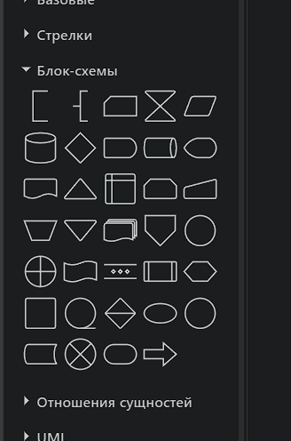
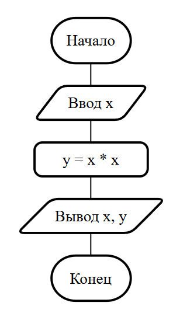
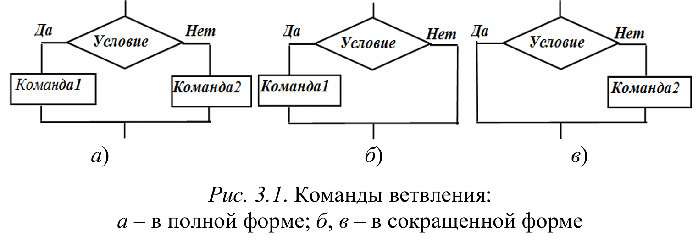
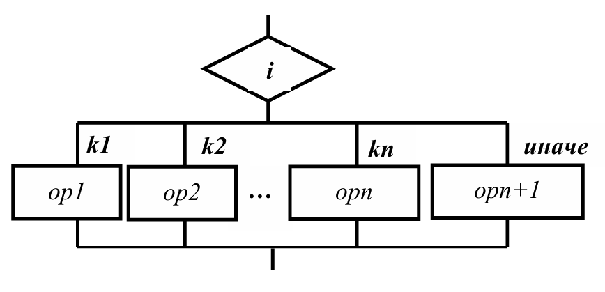
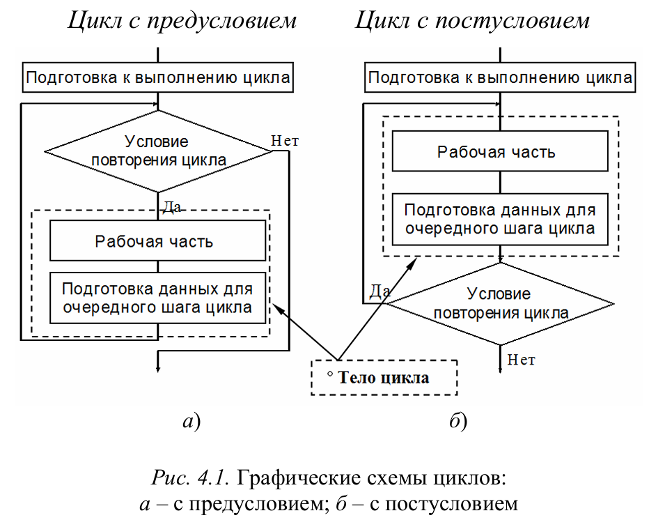

**Основы алгоритмизации и программирования**

## Требования к л.р.

### Шаблон и структура отчета (2-й семестр)
В этом семестре требования к оформлению отчета повышаются. Отчет - это, прежде всего, небольшая документация к разработанным программам, поэтому он должен быть оформлен адекватно.

Немного изменена структура отчета. Файл с новой структурой и ее описанием: [Word-файл](../files/template-report.docx) (его можно скачать. Нажимаем на него, далее справа расположена кнопка загрузки).

Методические указания по оформлению отчета расположены тут: [файл](../files/report-requirements.docx).

Начинать оформлять нужно уже с 1-й л.р. (двумерные массивы).

### Блок-схемы
**Блок-схемы** можно составлять в https://app.diagrams.net/. Элементы для нее находятся в соответствующей вкладке - "Блок-схемы", линии для соединения - во вкладке "Общие".

  

**Шрифт текста** на блок-схемах: *Times New Roman*, размер: 14 пт.

Блок-схемы должны быть выполнены на белом фоне. Также они должны быть представлены в адекватном виде: выровнены, с одинаковыми отступами между элементами и т.д., иначе будем учиться рисовать их ручками в тетради.

Пример блок-схемы:

  

Блок-схемы для ветвлений (if-else):

  

Блок-схемы для ветвлений (switch):

  

Блок-схемы для циклов:

  

### Тестирование и верификация

Тестирование программы - это важный этап разработки, позволяющий убедиться, что разработанная программа работает правильно для всех предусмотренных случаев. Даже если программа успешно компилируется, это не гарантирует ее корректность: ошибки могут проявляться только при определенных входных данных. Поэтому тестирование помогает выявить неточности в логике, проверить граничные условия и убедиться, что программа выдает ожидаемый результат.

Для выполнения тестирования Вам необходимо:
- составить таблицу тестов с тремя столбцами: что тестируется, входные данные и ожидаемый результат
- заполнить таблицу данными для тестирования, при этом необходимо учитывать все возможные варианты входных данных
- запустить программу несколько раз для каждого тестового набора входных данных. Сравнить полученный вывод программы с ожидаемым