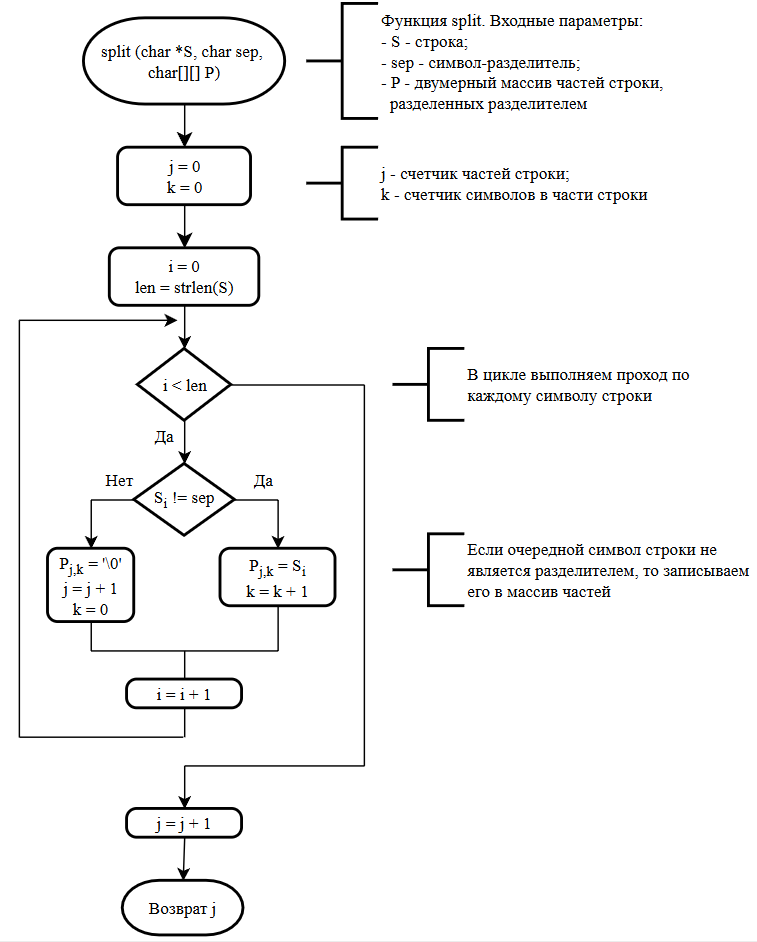

**Основы алгоритмизации и программирования**

## Теория для выполнения курсовой работы

*Примечание: эта теория не содержит подробного описания к некоторым компонентам и механизмам языка программирования C (например, для структур, функций, заголовочных файлов и т.д.). По ним здесь описана краткая вводная теория. Более подробную информацию Вы можете найти и прочитать в учебно-методическом курсе на учебном портале.*

### Введение

Перед разработкой и в процессе разработки программы необходимо составлять документацию к проекту. В реальном мире 70% всей работы - это работа над документацией, 30% - это разработка программы. Хорошая документация обеспечит Вам быструю разработку программы и минимизирует количество ошибок.

Первая часть документации у Вас уже есть - это тесты. Теперь необходимо выполнить следующее:
1. Выделить какие есть данные, определить их типы и ограничения.
2. Определить какие необходимы операции обработки данных.

### Анализ исходных данных

Анализ исходных данных выполняется достаточно просто. 
1. Выпишите список графов, которые есть в исходных данных.
2. Для каждого графа определите является ли он простым или составным (составной тип состоит из нескольких простых типов, т.е. число, символ, массив).
3. Если графа простая, то определяем какого она типа. Если составная, то определяем из каких частей она состоит и определяем тип для каждой части.
4. Описываем ограничения для каждой графы (например, должен быть больше 0).

Пример.
```txt
В текстовом файле находится музыкальный каталог, содержащий данные о композициях и состоящий из шести граф: Номер; Исполнитель; Название; Жанр; Год выпуска; Длительность.
```

Графы:
- Номер
	- Целое число
	- Больше 0
- Исполнитель
	- Массив символов
	- Максимальная длина 30
- Название
	- Массив символов
	- Максимальная длина 30
- Жанр
	- Перечисление
	- Варианты: *Rock*, *Pop*, *Hip-Hop*, *Dance*
- Год
	- Целое число
	- Диапазон от 1900 до 2026 включительно
- Длительность
	- Составной
		- Минуты
			- Целое число
			- От 0 до 60
		- Секунды
			- Целое число
			- От 0 до 60

### Операции обработки данных

Базово любая **информационная система** содержит четыре операции обработки данных:
- создание (*create*)
- чтение (*read*)
- изменение (*update*)
- удаление (*delete*)

Сокращенно список этих операций называется ***CRUD*-операции**.

Эти операции должны быть **обязательно**! Остальные операции обработки данных зависят от решаемой задачи. Прочитайте условие задачи в бланке курсовой работы и определите что Вам необходимо еще реализовать. Например, это может быть:
- расчет средней цены по каждому типу товара
- расчет суммарной (общей) цены по каждому типу товара

В результате Вы должны получить полный **список необходимых операций для обработки данных**.

### Создание базового проекта

По мере усложнения логики программы писать весь код в одном файле становится неэффективно. Это затрудняет навигацию по исходному коду, усложняет отладку и делает проект практически нечитаемым. 

Для создания качественной информационной системы мы будем использовать **модульный подход**, разделяя описание данных, логику их обработки и интерфейс взаимодействия. Ключевым инструментом для такой организации в языке *C* являются **заголовочные файлы**.

Если представить программу как книгу, то заголовочный файл - это её **оглавление**. Он не содержит подробного описания того, как работают функции, но четко говорит, какие инструменты доступны в данном модуле.

В **заголовочном файле** содержатся объявления прототипов функций (например, для *CRUD* и других операций), а также связанные с этими функциями переменные и структуры.

Зачем это нужно? Открыв заголовочный файл, можно увидеть возможности модуля, не отвлекаясь на сотни строк кода реализации этого модуля.

В рамках курсовой работы у Вас будет **два модуля**. **Первый** - точка старта приложения и консольное меню, а **второй** - модуль, который содержит описание предметной области в виде структур, а также функции для обработки данных.

Теперь приступим к созданию проекта. Создайте папку с названием Вашего приложения (использовать только латинские буквы). Название должно быть "говорящим", чтобы понять с чем связано приложение (например, `Music Manager`).

В папке создайте следующие файлы и папки:
- папка `data` - содержит файлы с исходными данными и результатами обработки данных;
- файл `main.c` - основной файл программы, с которого будет начинаться ее выполнение (точка старта программы);
- заголовочный файл формата `.h` (название файла зависит от предметной области, при этом отдельные слова в названии разделять не нужно, все пишется слитно, например: `musicmngr.h`);
- файл `musicmngr.c` (название так же зависит от предметной области) - файл, который будет содержать реализацию функций, прототипы которых описаны в заголовочном файле `musicmngr.h`.

Для файлов с исходным кодом (`.c` и `.h`), а также файлов с исходными данными Вы должны задать кодировку `Windows 1251` (`ANSI`) для поддержки кириллицы. Сделать это можно с помощью блокнота:
1. Откройте файл в блокноте.
2. В меню `Файл` нажмите на `Сохранить как`.
3. В диалоговом окне выберите тип файла `Все файлы`, а в кодировке укажите `ANSI`.
4. Нажмите на заменяемый файл, подтвердите замену.

В файле `main.c` напишите базовый код - функция `main`. Также можете заранее подключить заголовочный файл. Пример:

```C
/* Подключаем наш заголовочный файл, который хранит
 * прототипы функций для работы с плейлистом.
 */
#include "musicmngr.h"

int main() {
    return 0;
}
```

В заголовочном файле необходимо задать директивы для предотвращения ошибок компиляции при многократном подключении этого файла (т.е. если Вы будете подключать заголовочный файл в нескольких `.c`-файлах, ошибки компиляции не будет). На самом деле, все гораздо сложнее. Это очень простое объяснение.

```C
/* Это заголовочный файл. Он содержит прототипы функций для работы
 * с данными предметной области "Музыкальный каталог".
 * Реализация этих функций может быть любой. Т.е. Вы можете создать
 * несколько файлов, в которых реализовано несколько вариантов этих функций,
 * а в файле main.c выбирать нужную версию путем изменения подключаемого
 * файла реализации.
 */

#ifndef MUSIC_MNGR_H
#define MUSIC_MNGR_H

// Здесь будут переменные и прототипы функций

#endif
```

Замените название `MUSIC_MNGR_H` на любое. Главное условие - оно должно быть уникальным (среди всех Ваших `.h` файлов). Также в конце этого названия обязательно должно быть `_H`.

В реализации заголовочного файла (в моем случае это `musicmngr.c`) подключите заголовочный файл:

```C
/* В этом файле описаны реализации функций, прототипы которых
 * описаны в файле musicmngr.h
 */

#include "musicmngr.h"
```

Обратите внимание на комментарии в начале всех файлов. У Вас они тоже должны быть написаны. Это является частью документации к коду. Эти комментарии кратко описывают назначение файла.

Также обратите внимание, что при подключении собственных заголовочных файлов их названия обрамлены в символ `"`, а не в `<>`. Это означает, что Вы подключаете свой собственный заголовочный файл, а не из стандартной библиотеки *C* (как, например, `stdio.h`).

### Описание структуры исходных данных в коде

Т.к. исходные данные представлены в табличном виде, описывать их несколькими переменными неудобно и неэффективно. Например, так делать плохо:

```C
char artists[100][30]; // Исполнитель
char titles[100][30];  // Название композиции
int years[100];        // Год выпуска
...
```

В данном случае данные представлены в виде отдельных матриц и массивов, описывающих каждый столбец. Удобнее всего было бы объединить эти данные и для этой цели в языке *C* существует **Структура**.

**Структура** - это пользовательский тип данных. Она позволяет объединить под одним именем переменные разных типов (int, char, float и т.д.).

Теперь вернемся к результатам анализа предметной области (список графов, их типов и ограничений). Используя этот список, Вы можете реализовать структуру. Выполняется это довольно просто.

Сначала реализуйте структуры, описывающие составные графы. В моем случае, это "Продолжительность" (*Duration*) и "Жанр" (*Genre*):

```C
/**
 * Продолжительность музыкальной композиции
 * @param minutes Минут
 * @param seconds Секунд
 */
typedef struct
{
    int minutes;
    int seconds;
} Duration;

/**
 * Перечисление жанров музыки
 */
typedef enum {
    ROCK,
    POP,
    DANCE,
    HIP_HOP,
    UNKNOWN
} Genre;
```

Т.к. жанры музыки - это, как правило, "статические" данные (если, конечно, кто-то не решит придумать новый очередной жанр), то описать их можно с помощью типа данных "Перечисление" (*enum*). Здесь все просто: перечисляете через запятую список возможных значений (обязательно все буквы должны быть в верхнем регистре).

После описания составных данных, приступаем к описанию основных данных. В моем случае - это музыкальная композиция (*Track*):

```C
/**
 * Музыкальная композиция
 * @param index Номер
 * @param artist Исполнитель
 * @param title Заголовок
 * @param genre Жанр
 * @param year Год
 * @param duration Продолжительность
 */
typedef struct
{
    int index;
    char artist[30];
    char title[30];
    Genre genre;
    int year;
    Duration duration;
} Track;
```

Обратите внимание, что в состав этой структуры включены экземпляры ранее описанных структур.

Таким образом, мы описали данные предметной области в виде структур. Но нам еще необходимо где-то хранить экземпляры структуры `Track`. Не вопрос, можем использовать массив. Но, т.к. содержимое массива в процессе выполнения программы будет динамически изменятся, необходимо знать сколько на данный момент содержится экземпляров структруры `Track` в массиве:

```C
int count;           // текущее количество композиций в массиве
Track playlist[100]; // массив с композициями
```

Как видим, у нас есть две связанные переменные. Соответственно, их можно смело объединить в структуру для удобства использования:

```C
#define PLAYLIST_SIZE 100

/**
 * Коллекция для хранения музыкальных композиций
 * @param count Количество композиций
 * @param elements Массив экземпляров структур, описывающих композицию
 */
typedef struct {
    int count;
    Track elements[PLAYLIST_SIZE];
} Playlist;
```

Обратите внимание как объявлен статический массив в этой структуре, а именно его размер. `PLAYLIST_SIZE` - это макрос, который задан с помощью директивы `#define` - это директива препроцессора, которая позволяет создать макрос для замены определенного имени (идентификатора) на текстовое значение еще до начала компиляции программы.

В контексте массивов это используется для задания константы размера. В примере выше задан макрос `PLAYLIST_SIZE 100`. Компилятор автоматически подставит число `100` везде, где встретит слово `PLAYLIST_SIZE`, что позволяет менять размер массива во всем коде, исправив всего одно число в начале файла.

### Функции и прототипы функций. Реализация механизма консольного меню

Определив какие у нас есть данные, а также какие необходимы операции обработки этих данных, можно составить список опций меню, доступных пользователю. В общем, нам нужно следующее:
- выполнить загрузку данных из файла
- обработать данные и посмотреть результат
- сохранить обработанные данные в файл

Для предметной области "Музыкальный каталог" опции меню будут следующие:
1. Загрузить плейлист из *csv*-файла.
2. Вывести содержимое плейлиста.
3. Добавить музыкальную композицию в плейлист
4. Обновить музыкальную композицию в плейлисте.
5. Удалить музыкальную композицию из плейлиста.
6. Вывести статистику по плейлисту.
7. Сохранить плейлист в *csv*-файл.

Алгоритм консольного меню следующий:
1. Вывести список доступных опций.
2. Запросить пользователя ввести номер пункта меню.
3. В зависимости от выбранного пользователем пункта меню выполнить соответствующее действие.

Чтобы программа не завершалась после выполнения одного выбранного пользователем пункта меню, необходимо перечисленные выше действия выполнять циклически до тех пор, пока пользователь не выберет опцию выхода из программы.

Т.к. у нас еще отсутствует код, который выполняет действия, соответствующие пунктам меню, нам необходимо разработать функции-заглушки и реализовать консольное меню с использованием этих функций.

**Функция** - это именованный блок кода, выполняющий конкретную задачу. С ее помощью можно разбить программу на логические части. В языке программирования *C* функция имеет следующую структуру:

```C
тип_возврата имя_функции(параметры) {
    // тело функции
    return значение;
}
```

- `тип_возврата` - это тип данных, который функция возвращает после работы (если ничего не возвращает, то указывается тип `void`)
- `параметры` - это входные переменные, с которыми работает функция;
- `тело функции` - последовательность инструкций для решения задчи.

Также в языке *C* можно объявить прототипы функций. **Прототип функции** - это предварительное объявление функции, которое сообщает компилятору о её существовании до её полного определения. Прототипы функций также помогают в организации кода и повышают его читаемость. Они позволяют вызывать функции еще до места их фактической реализации. Прототип функции имеет следующую структуру:

```C
тип_возврата имя_функции(параметры);
```

Как правило, структура файла с исходным кодом с использованием прототипов функции выглядит следующим образом:

```C
// Здесь подключаются библиотеки

/** Здесь описаны прототипы-функций. Чем удобно? Открываем файл,
 * видим прототипы, по ним понимаем какие есть функции и что они
 * делают, но при этом не отвлекаемся на реализацию этих функций
 * (например, меня не интересует как выполняется ввод массива из
 * стандартного потока ввода. Я хочу просто знать, что такая функция
 * есть). Например:
 */
void inputArrayFromStdin(float *array, int size);
int findZerosCountInArray(float *array, int size);
void outputArrayToStdout(char *array_name, float *array, int size);

// Здесь функция main (или без нее)

/* 
 * А здесь уже описаны реализации функций. Если я захочу
 * изучить как, к примеру, реализован ввод массива из стандартного потока
 * ввода, я посмотрю на эту часть файла.
 */
void inputArrayFromStdin(float *array, int size) {
    for (int i = 0; i < size; i++) {
	    printf("A[%d] = ", i + 1);
		scanf("%f", &array[i]);
	}
}

// И т.д.
```

Теперь приступим к реализации меню. Код пишем в файле `main.c`.

Первым этапом подключим библиотеку `windows.h` для вызова системных утилит (пауза, очистка консоли, установка кодировки консоли) и установим кодировку `Windows 1251` для консоли:

```C
#include <windows.h>

// ...

int main() {
    // Установка кодировки в консоли для поддержки рус. яз.
    SetConsoleCP(1251);
    SetConsoleOutputCP(1251);

	// ...
}
```

Далее опишем прототипы-функций пунктов меню. Для того, чтобы пометить, что функция принадлежит к консольному меню, в названии функции добавим префикс `menu` (это для читаемости кода):

```C
#include ...

/**
 * Выводит в stdout пункты меню
 */
void menuPrintOptions();

/**
 * Функция меню: открыть csv-файл с исходными данными
 */
void menuLoadPlaylistFromCsvFile();

/**
 * Функция меню: вывести в stdout содержимое плейлиста 
 * в виде таблицы
 */
void menuPrintPlaylist();

/**
 * Функция меню: добавить новую музыкальную композицию 
 * в плейлист
 */
void menuAddTrack();

/**
 * Функция меню: обновить музыкальную композицию в 
 * плейлисте
 */
void menuUpdateTrack();

/**
 * Функция меню: удалить музыкальную композицию из 
 * плейлиста
 */
void menuDeleteTrack();

/**
 * Функция меню: вычислить и вывести в stdout статистику 
 * по плейлисту: средняя и общая длительность композиций 
 * для каждого жанра
 */
void menuPrintStatistics();

/**
 * Функция меню: сохранить плейлист в csv-файл
 */
void menuSavePlaylistToFile();

int main() {
    // ...
}
```

Обратите внимание на комментарий перед прототипом функции. Это называется автодокументация. Если Вы откроете файл в *IDE*, которая умеет обрабатывать такие комментарии (например, *VS Code*), то она сможет в удобном виде составить список функций и их описание по Вашим комментариям.

Далее после функции `main` напишите реализации этих прототипов. Первая - для вывода пунктов меню в `stdout`, а остальные - в виде функций-заглушек. Например:

```C
void menuPrintOptions() {
    printf("Выберите желаемое действие:\n");
    printf("1. Загрузить плейлист из csv-файла\n");
    printf("2. Вывести содержимое плейлиста\n");
    printf("3. Добавить музыкальную композицию в плейлист\n");
    printf("4. Обновить музыкальную композицию в плейлисте\n");
    printf("5. Удалить музыкальную композицию из плейлиста\n");
    printf("6. Вывести статистику по плейлисту\n");
    printf("7. Сохранить плейлист в csv-файл\n");
    printf("0. Выход\n");
}

void menuLoadPlaylistFromCsvFile() {
    printf("ЗАГЛУШКА: загрузка данных из csv-файла\n");
}

// И аналогично остальные функции
```

Теперь в функции `main` реализуем механизм меню.

```C
int main() {
    // ...
	
	int choice = -1;    // выбор пользователя

	while (choice != 0) {
        system("cls");         // очищаем консоль
        menuPrintOptions();    // выводим пункты меню
        scanf("%d", &choice);  // ожидаем выбор пользователя

        switch (choice)
        {
	        case 1:
	            menuLoadPlaylistFromCsvFile();
	            break;
	        case 2:
	            menuPrintPlaylist();
	            break;
	        case 3:
	            menuAddTrack();
	            break;
	        // По аналогии остальные обработчики
        }

        // Если пользователь не выбрал выход из программы
        if (choice != 0) {
            system("pause");    // ожидание нажатия любой клавиши
        }
    }

    return 0;
}
```

Теперь скомпилируйте все файлы с исходным кодом. В *IDE DevC*++ делаем как обычно (*Compile* & *Run*), в *IDE VS Code* вызываем компилятор и передаем ему все `.c` файлы: 

```
gcc main.c musicmngr.c -o app
```

Запустите программу. Протестируйте все пункты меню и убедитесь, что при выборе каждого пункта меню вызывается соответствующая ему функция.

### Работа со структурами и передача их в функцию
Для инициализации экземпляра структуры необходимо написать следующий код (на примере моей структуры `Track`):

```C
Track track;
```

И далее можно выполнять различые операции с ней, например, обращение к ее полям через оператор `.`:

```C
track.year = 2005;
```

Работа со структурами часто требует написания повторяющегося кода (например, для ввода/вывода), поэтому логично выносить эти действия в функции. Чтобы эффективно писать такие функции, нужно разобраться, как именно данные попадают внутрь них. Для чего это нужно Вы узнаете дальше.

Существует два способа передачи параметров в функцию:
- по значению (копирование данных);
- по указателю (передача адреса данных).

По умолчанию, в *C* переменные в функцию передается **по значению**. Это значит, что при вызове функции создается полная **КОПИЯ** переменной в своей области памяти. Пример:

```C
void changeValue(int a) {
    // В функции переменная a - это лишь временная копия.
    // Изменение этой копии не влияет на оригинал вне функции
    a = a * 2;
}

int a = 5;
changeValue(a);      // передаем переменную по значению
printf("a = %d", a); // будет выведено 5
```

Почему так сделано? При вызове функции в оперативной памяти выделяется небольшая область, которая доступна только ей. Изоляция данных позволяет функции работать безопасно: она не может случайно испортить переменные в основной программе. Однако, если передавать так огромную структуру (например, объемом в несколько сотен Мб), компьютер потратит много времени и памяти на создание ее копии.

Если мы хотим, чтобы функция изменила оригинал, или хотим избежать дорогого копирования большой структуры, то необходимо использовать указатели.

**Указатель** - это специальный тип, который хранит не само значение, а адрес ячейки памяти, где это значение находится.

Чтобы получить адрес переменной, необходимо использовать оператор взятия адреса (`&`):

```C
int a = 5;
int *pointer = &a;
```

В этом примере переменная `pointer` имеет тип указателя на целое число (`int *`) и хранит адрес переменной `a`.

Для выполнения обратного действия - достать значение, лежащее по адресу, - используется оператор разыменования (`*`):

```C
int a = 5;
int *pointer = &a;    // получаем адрес переменной a

a = 1000;

// получаем значение, которое лежит по адресу в pointer
int b = *pointer;   // b = 1000
```

Теперь чтобы передать функции переменную и изменить ее значение внутри этой же функции, необходимо передать указатель на эту переменную:

```C
void changeValue(int *a) {
    // Получаем значение по адресу, удваиваем и записываем обратно
    *a = (*a) * 2;
}

int a = 5;
changeValue(&a);      // передаем адрес переменной a
printf("a = %d", a);  // будет выведено 10
```

Что-то подобное Вы уже видели и использовали: при вызове функции `scanf`:

```C
int a;

scanf("%d", &a);
```

Именно поэтому в функции `scanf` мы пишем `&a`. Функции нужно знать, в какую именно ячейку памяти положить введенное пользователем число. Если убрать `&`, программа попытается использовать значение переменной `a` как адрес памяти, что приведет к ошибке `Segmentation Fault` (попытка записи в недопустимую область памяти).

А теперь рассмотрим случай со структурами. Допустим, что у нас есть "тяжелая" структура, которая хранит в себе массив весом, например, в 200 Мб:

```C
typedef struct {
    int count;
    Track elements[1000000];
} Playlist;

Playlist playlist;    // создаем экземпляр структуры

/*
 * Допустим, что тут блок кода для ввода элементов
 * массива playlist.elements в количестве 1000000.
 * На выходе получается размер массива в 200 Мб
 */
```

Необходимо написать функцию, которая вычисляет количество музыкальных композиций, выпущенных в заданном году:

```C
/**
 * Подсчет количества музыкальных композиций, выпущенных
 * в заданном году
 * @param playlist Экземпляр структуры Playlist
 * @return Количество музыкальных композиций, выпущенных в заданном году
 */
int PlaylistCountTracksByYear(Playlist playlist, int year) {
    int count = 0;

    for (int i = 0; i < playlist.count; i++) {
        if (playlist.elements[i].year == year) {
            count++;
        }
    }

    return count;
}
```

В этом случае в функцию переменная `playlist` передается по значению, т.е. создается ее копия и функция работает уже с копией этого экземпляра структуры. Напомню, что экземпляр структуры имеет вес в 200 Мб. А значит, что при передаче его в функцию по значению общее потребление памяти программой увеличится на 200 Мб:

```C
/* 
 * Допустим, что при запуске программы потребление
 * памяти составляет около 5 Мб
 */

// ...

int main() {
    Playlist playlist;

    /*
     * Тут блок кода для ввода элементов массива 
     * playlist.elements в количестве 1000000
     */

    /*
     * На этом этапе потребление памяти составляет
     * примерно 210 Мб
     */

    // Вызываем функцию для подсчета количества музыкальных
    // композиций, выпущенных в заданном году. При вызове этой 
    // функции потребление памяти составит около 410 Мб, т.к. 
    // создастся копия экземпляра структуры playlist
    int tracks_count_2010 = PlaylistCountTracksByYear(playlist, 2010);

    /*
     * После выполнения функции область памяти, выделенная ей,
     * очистится, поэтому потребление памяти составит около 210 Мб
     * (как и до вызова этой функции)
     */

    return 0;
}
```

Чтобы не создавать копию экземпляра структуры при каждом вызове функции и, тем самым, не потреблять много памяти, в функцию необходимо передавать указатель на структуру. Пример для той же самой функции:

```C
/**
 * Подсчет количества музыкальных композиций, выпущенных
 * в заданном году
 * @param playlist Указатель на структуру Playlist
 * @return Количество музыкальных композиций, выпущенных в заданном году
 */
int PlaylistCountTracksByYear(Playlist *playlist, int year) {
    int count = 0;

    for (int i = 0; i < playlist->count; i++) {
        if (playlist->elements[i].year == year) {
            count++;
        }
    }

    return count;
}

// Вот так выглядит вызов этой функции
int tracks_count_2010 = PlaylistCountTracksByYear(&playlist, 2010);
```

Обратите внимание как теперь происходит обращение к элементам структуры. Вместо `.` теперь используется оператор `->`, т.к. переменная `playlist` - это указатель на структуру, а не экземпляр структуры. Т.е.:
- оператор `.` используется для экземпляра структуры;
- оператор `->` используется для указателя на структуру.

*Примечание: передача массива в функцию выполняется немного иначе. Т.к. массив - это уже указатель на непрерывную область памяти, то при передаче его в функцию использовать оператор `&` не нужно.*

Например, вот так может быть реализован ввод простых данных с использованием структур и функций:
```C
typedef struct {
    char name[30];
    int value;
} Parameter;

typedef struct {
    int count;
    Parameter elements[100];
} ParametersCollection;

/**
 * Ввод структуры Parameter из stdin
 * @param parameter Указатель на структуру Parameter
 */
void ParameterInputFromStdin(Parameter *parameter) {
    printf("Введите название параметра: ");
    gets(parameter->name);

    printf("Введите значение параметра: ");
    scanf("%d", &parameter->value);
}

/**
 * Вывод структуры Parameter в stdout
 * @param parameter Указатель на структуру Parameter
 */
void ParameterOutputToStdout(const Parameter *parameter) {
    printf("Параметр <%s> = %d", parameter->name, parameter->value);
}

int main() {
    ParametersCollection parameters;

    printf("Введите желаемое количество параметров (до 100): ");
    scanf("%d", &parameters.count);

    // Ввод
    for (int i = 0; i < parameters.count; i++) {
        ParameterInputFromStdin(&parameters.elements[i]);
    }

    // Вывод
    for (int i = 0; i < parameters.count; i++) {
        ParameterOutputToStdout(&parameters.elements[i]);
    }
}
```

Обратите внимание, что в функции `ParameterOutputToStdout` переменная `parameter` передается с модификатором `const`. Это означает, что эта переменная не должна модифицироваться внутри функции. В функции ее можно только лишь читать.

### Работа с файлами
Работа с файлами в языке *C* строится вокруг понятия потока (*stream*). Для программы файл - это просто последовательность байтов, к которой мы получаем доступ через специальный указатель.

Все операции с файлом начинаются с объявления указателя на структуру `FILE`. Для получения экземпляра структуры `FILE` используется функция `fopen`. Она связывает физический файл на диске с потоком в программе:

```C
FILE *file = fopen("data.csv", "r");
```

В качестве входных параметров функция `fopen` принимает массив символов, содержащий путь к файлу на диске, и режим работы с файлом:
- `r` - для чтения;
- `w` - для записи.

Есть и другие режимы. Изучите их самостоятельно.

Если файл не удалось открыть, то функция `fopen` вернет нуль-указатель (`NULL`). С помощью условного выражения Вы должны обязательно проверить удалось ли открыть файл, чтобы программа не завершилась с ошибкой:

```C
// Если файл не удалось открыть
if (file == NULL) {
    // ...
}
```

Т.к. файл с исходными данными представляет собой набор записей в виде строк, то читать его следует построчно. Для этого используется функция `fgets`, которая в качестве входных данных принимает:
- массив символов, в который будет записана прочитанная строка;
- размер массива символов;
- указатель на структуру `FILE`.

При достижении конца файла функция `fgets` вернет нуль-указатель.

```C
char buffer[100];

while (fgets(buffer, sizeof(buffer), file) != NULL) {
    printf("%s", buffer);    // вывод прочитанной строки
}
```

Имейте ввиду, что в `buffer` уже содержится `\n`.

В конце работы с файлом необходимо ОБЯЗАТЕЛЬНО вызвать функцию `fclose`, в которую нужно передать указатель на структуру `FILE`. Эта функция закрывает файл:

```C
fclose(file);
```

Для записи данных в файл код будет практически аналогичный. Необходимо открыть файл в режиме записи и писать строки с использованием функции `fputs` или `fprintf`. Запись осуществляется аналогично выводу на экран (функции `puts` и `printf`), но только в эти функции необходимо еще передать указатель на структуру `FILE`:

```C
FILE *file = fopen("results/data.txt", "w");

// проверка: удалось ли открыть файл
// if ...

fputs("Это обычная строка", file);
fprintf(file, "Результат равен %d", result);

fclose(file);
```

*ВАЖНОЕ примечание: минимизируйте операции работы с файлом. Открытие и запись файла - это затратные операции, на выполнение которых необходимо время из-за обращения к диску. Обычно, работа с файлами происходит по такому сценарию:*
1. Открыть файл для чтения и записать его содержимое в оперативную память, закрыть файл.
2. Обработать данные, прочитанные из файла (здесь может быть несколько операций);
3. После выполнении ВСЕХ операций обработки открыть файл для записи, записать в него обработанные данные, закрыть файл.

### Важное дополнение к функциям
Для создания качественного и легко читаемого кода очень важно придерживаться принципа единой ответственности, согласно которому каждая написанная Вами функция должна решать ровно одну задачу.

Когда одна функция одновременно занимается вводом данных, их обработкой и выводом результата, она превращается в трудночитаемый «комбайн», который сложно отлаживать и практически невозможно использовать повторно. 

Например, если логика расчетов жестко связана с чтением из конкретного файла, Вы не сможете применить те же вычисления для данных, полученных из консоли или другого источника, без переписывания всего кода.

Например, вот так функции писать плохо:

```C
void process() {
    char filename[100];
    printf("Введите имя файла: ");
    scanf("%s", filename);

    FILE *f = fopen(filename, "r");
    if (f == NULL) return;

    int num, sum = 0;
    while (fscanf(f, "%d", &num) == 1) {
        sum += num;
    }

    printf("Сумма чисел в файле: %d\n", sum);
    fclose(f);
}
```

Функция `process` выполняет сразу несколько действий: запрашивает у пользователя имя файла, открывает файл, читает его содержимое и в процессе чтения выполняет расчет, выводит результат расчета.

А теперь перепишем этот код с правильным разделением ответственности:

```C
/**
 * Функция для расчета суммы
 */
int calculate_sum(int *data, int count) {
    int sum = 0;
    for (int i = 0; i < count; i++) {
        sum += data[i];
    }
    return sum;
}

/**
 * Функция ввода данных (из файла)
 */
int load_data(const char *filename, int *buffer, int max_size) {
    FILE *f = fopen(filename, "r");
    if (!f) return -1;

    int count = 0;
    while (count < max_size && fscanf(f, "%d", &buffer[count]) == 1) {
        count++;
    }

    fclose(f);
    return count;
}

/**
 * Функция main: здесь соединяем все функции
 * в нужной последовательности
 */
int main() {
    int numbers[100];
    int n = load_data("input.txt", numbers, 100);

    if (n > 0) {
        int total = calculate_sum(numbers, n);
        printf("Результат: %d\n", total);
    }

    return 0;
}
```

В исправленном варианте, если Вам понадобится считать не сумму, а среднее арифметическое, Вы просто добавите одну небольшую функцию, не трогая код для чтения файлов. 

А если же данные начнут поступать не из файла, а из массива в памяти, функция `calculate_sum` продолжит работать без изменений. Именно такая гибкость делает программу надежной и легко читаемой.

### Алгоритм преобразования строки в экземпляр структуры
Т.к. данные мы храним в экземплярах структур, описывающих предметную область, а в файле данные содержатся в виде строк, то необходим алгоритм преобразования строки в экземпляр структуры.

Например, в файле есть такая строка:

```CSV
1;AC/DC;Back In Black;Rock;1980;4:15
```

Ее необходимо преобразовать в экземпляр структуры `Track`, в которой есть экземпляры структуры `Duration` и перечисления `Genre`:

```C
/**
 * Продолжительность музыкальной композиции
 * @param minutes Минут
 * @param seconds Секунд
 */
typedef struct
{
    int minutes;
    int seconds;
} Duration;

/**
 * Перечисление жанров музыки
 */
typedef enum {
    ROCK,
    POP,
    DANCE,
    HIP_HOP,
    UNKNOWN
} Genre;

/**
 * Музыкальная композиция
 * @param index Номер
 * @param artist Исполнитель
 * @param title Заголовок
 * @param genre Жанр
 * @param year Год
 * @param duration Продолжительность
 */
typedef struct
{
    int index;
    char artist[30];
    char title[30];
    Genre genre;
    int year;
    Duration duration;
} Track;
```

Т.к. структура `Track` описывает столбцы *csv*-файла, а значения каждого столбца в строках этого файла разделяются с помощью `;`, то необходимо реализовать следующий алгоритм:
1. Разбить строку на части по разделителю `;`.
2. Обработать каждую часть строки соответствующим образом (например, преобразовать строку в число или в перечисление).
3. Поместить обработанные части строки в экземпляр структуры.

Реализуем следующие функции:
- для разбиения строки на части по указанному разделителю;
- для преобразования строки в экземпляр перечисления `Genre`;
- для преобразования строки в экземпляр структуры `Duration`;
- для преобразования строки в экземпляр структуры `Track`.

Функцию для разбиения строки на части по указанному разделителю можно реализовать согласно следующей блок-схеме:

<p align="center">
  
</p>

*Примечание: количество строк в двумерном массиве P зависит от количества столбцов в исходных данных.*

В функции для преобразования строки в экземпляр перечисления `Genre` можно реализовать такой алгоритм:

```C
/**
 * Заполняет экземпляр перечисления Genre данными из строки.
 * Если элемент перечисления отсутсвует, то устанавливается
 * значение UNKNOWN
 * @param string Строка с названием жанра
 * @param genreToFill Указатель на перечисление Genre
 */
void GenreFromString(const char *string, Genre *genreToFill) {
    if (strcmp(string, "Rock") == 0) {
        *genreToFill = ROCK;
    } else if (strcmp(string, "Pop") == 0) {
        *genreToFill = POP;
    } else if (strcmp(string, "Dance") == 0) {
        *genreToFill = DANCE;
    } else if (strcmp(string, "Hip-Hop") == 0) {
        *genreToFill = HIP_HOP;
    } else {
        *genreToFill = UNKNOWN;
    }
}
```

Алгоритм работы этой функции простой: сравниваем строки и присваеваем соответствующий входной строке вариант перечисления.

Далее функция для преобразования строки в экземпляр структуры `Duration`. Т.к. структура `Duration` содержит только лишь простые типы данных (целые числа), то для преобразования строки в экземпляр этой структуры можно использовать функцию `sscanf`. Суть ее не отличается от стандартной функции `scanf`, но только строка для обработки передается в качестве входного параметра:

```C
/**
 * Заполняет объект структуры Duration данными из строки
 * @param string Строка с длительностью формата mm:ss (минуты:секунды)
 * @param durationToFill Указатель на структуру Duration
 */
void DurationFromString(const char *string, Duration *durationToFill) {
    sscanf(string, "%d:%d", &durationToFill->minutes, &durationToFill->seconds);
}
```

И теперь функция для преобразования строки в экземпляр структуры `Track`. Здесь мы применяем ранее разработанные функции, а также функции для преобразования строки в число:

```C
/**
 * Заполняет объект структуры Track данными из строки
 * формата csv
 * @param string Строка формата csv с данными о музыкальной
 * композиции (Номер;Исполнитель;Название;Жанр;Год;Длительность)
 * @param trackToFill Указатель на структуру Track
 */
void TrackFromCsvString(const char *string, Track *trackToFill) {
    // Массив частей csv-строки
    char parts[6][50];
    
    // Делим строку на части
    int parts_count = split(string, ';', parts);

    trackToFill->index = atoi(parts[0]);
    strcpy(trackToFill->artist, parts[1]);
    strcpy(trackToFill->title, parts[2]);
    GenreFromString(parts[3], &trackToFill->genre);
    trackToFill->year = atoi(parts[4]);
    DurationFromString(parts[5], &trackToFill->duration);
}
```

Обратите внимание, что для записи строки в поле экземпляра структуры используется функция `strcpy` для копирования строки. Т.к. строка - это указатель на массив символов, то при обычном присваивании мы запишем в поле экземпляра структуры указатель, который хранится в переменной `parts`. Но при окончании работы функции `TrackFromCsvString` ее значение в памяти очистится, а соответственно и очистится значение в поле экземпляра структуры. Поэтому строки необходимо копировать.

Ниже представлен пример без копирования, в котором описано что произойдет в таком случае.

```C
void example(Track *trackToFill) {
    char *artist = "AC/DC";    // создаем локальную для этой функции переменную
    trackToFill->artist = artist;    // присваеваем указатель на массив символов
}

// ...

Track track;

// Во время выполнения этой функции в track в поле
// artist запишется строка "AC/DC"
example(&track);

// Будет выведена или пустая строка, или мусор из оперативной памяти, т.к.
// строка "AC/DC", созданная в функции example, уже очистилась
printf("%s", track.artist);
```

### Хранение массива записей (глобального экземпляра структуры)
Для хранения массива записей у Вас уже создана структура в заголовочном файле (в моем случае массив записей хранится в структуре `Playlist`). Чтобы использовать экземпляр этой структуры в рамках всего проекта (в качестве глобальной переменной), необходимо в заголовочном файле пометить экземпляр этой структуры с использованием ключевого слова `extern`:

```C
extern Playlist globalPlaylist;
```

В таком случае экземпляр структуры `Playlist` можно будет объявить в основном файле (`main.c`), но и при этом использовать в других файлах. Инициализацию экземпляра структуры необходимо выполнить вне какой-либо функции:

```C
#include ...

Playlist globalPlaylist;

int main() {
    globalPlaylist.count = 0;
    ...
}
```

Таким образом, у нас теперь есть глобальная переменная, в которой мы будем хранить массив записей. Назовем ее **глобальной коллекцией** и будем использовать это название в дальнейшем.

### Использование глобальной коллекции
Теперь в реализации функций заголовочного файла (файл `.c`) мы можем использовать созданную глобальную коллекцию. Пример для чтения файла:

```C
void PlaylistReadFromCsv(const char *filepath) {
    FILE *file = fopen(filepath, "r");
    
    int track_count = 0;
    char buffer[150];
    Track *track = NULL;
    
    fgets(buffer, sizeof(buffer), file); // пропускаем первую строку csv-файла
    
    while (fgets(buffer, sizeof(buffer), file) != NULL) {
        // Вызываем функцию для преобразования строки в экземпляр
        // структуры Track. При этом берем уже инициализированный экземпляр
        // из глобальной коллекции
        track = &globalPlaylist.elements[track_count];
        TrackFromCsvString(buffer, track);
        track_count++;
    }

    globalPlaylist.count = track_count;

    fclose(file);
}
```

### Вывод записей глобальной коллекции
Если при чтении файла мы реализовали функции, которые преобразуют строку в экземпляр структуры, то для вывода экземпляра структуры необходима функция, которая выполняет обратное действие: из экземпляра структуры в строку. Например, моя структура `Track` содержит экземпляры перечисления `Genre` и структуры `Duration`. Поэтому для вывода содержимого структуры `Track` прежде всего необходимо реализовать функции, которые преобразуют `Genre` и `Duration` в строку. Выполняется это очень просто с помощью функции `sprintf`, которая схожа со знакомой Вам функции `printf`, но только она выводит данные не на консоль, а в указанную строку:

```C
/**
 * Преобразует перечисление Genre в строку
 * @param genre Указатель на перечисление Genre
 * @param destination Строка назначения (статическая на 11 символов)
 */
void GenreToString(const Genre *genre, char destination[GENRE_STR_SIZE]) {
    switch (*genre)
    {
        case ROCK:
            sprintf(destination, "%s", "Rock");
            break;
        case POP:
            sprintf(destination, "%s", "Pop");
            break;
        case DANCE:
            sprintf(destination, "%s", "Dance");
            break;
        case HIP_HOP:
            sprintf(destination, "%s", "Hip-Hop");
            break;
        default:
            sprintf(destination, "%s", "UNKNOWN");
    }
}

/**
 * Преобразует структуру Duration в строку формата
 * mm:ss (минуты:секунды)
 * @param genre Указатель на структуру Duration
 * @param destination Строка назначения (статическая на 6 символов)
 */
void DurationToString(const Duration *duration, char destination[DURATION_STR_SIZE]) {
    sprintf(destination, "%02d:%02d", duration->minutes, duration->seconds);
}
```

А теперь можно реализовать функции для вывода содержимого глобальной коллекции:

```C
#include ...

#define GENRE_STR_SIZE    11
#define DURATION_STR_SIZE 7

#define TABLE_PLAYLIST_HEAD_TEMPLATE "|%5s|%-30s|%-30s|%-10s|%-4s|%-12s|\n"
#define TABLE_PLAYLIST_ROW_TEMPLATE  "|%5d|%-30s|%-30s|%-10s|%d|%-12s|\n"

/**
 * Выводит в stdout строку таблицы
 * @param track Указатель на структуру Track
 */
void TrackPrintTableRow(const Track *track) {
    // Объявляем переменные, в которые запишем экземпляры
    // Genre и Duration в виде строки
    char genre[GENRE_STR_SIZE];
    char duration[DURATION_STR_SIZE];

    // Преобразуем Genre и Duration в строку
    GenreToString(&track->genre, genre);
    DurationToString(&track->duration, duration);

    // И выведем уже содержимое экземпляра структуры Track
    printf(TABLE_PLAYLIST_ROW_TEMPLATE,
        track->index, track->artist, track->title,
        genre, track->year, duration
    );
}

/**
 * Вывод в stdout шапки таблицы
 */
void TrackPrintTableHead() {
    const int COUNT = 97;

    // Создаем строку с '-'
    char dash[COUNT];
    for(int i = 0; i < COUNT - 1; i++) dash[i] = '-';
    dash[COUNT - 1] = '\0';

    // Выводим шапку. Получится подобное:
    // |---------------------|
    // |Номер|Исполнитель    |
    // |---------------------|
    printf("|%s|\n", dash);
    printf(TABLE_PLAYLIST_HEAD_TEMPLATE, "Номер", "Исполнитель", "Название", "Жанр", "Год", "Длительность");
    printf("|%s|\n", dash);
}

/**
 * Вывод в stdout глобального плейлиста в табличном виде
 */
void PlaylistPrintTable() {
    // Выводим шапку таблицы
    TrackPrintTableHead();
    
    // И все записи
    for (int i = 0; i < globalPlaylist.count; i++)
    {
        TrackPrintTableRow(&globalPlaylist.elements[i]);
    }

    TrackPrintTableFooter();
}
```

### Выполнение расчетов
Например, пусть для моей предметной области будет такая задача:

```txt
Необходимо вычислить среднюю и суммарную продолжительность музыкальных композиций для каждого жанра.
```

Перед выполнением расчетов необходимо выполнить сортировку записей, т.к. реализовать алгоритм вычисления суммарных или средних показателей гораздо проще для отсортированного набора записей. Но при этом изменять массив с исходными записями категорически нельзя! Т.е. необходима копия массива записей, которая будет отсортирована.

Но копировать весь набор записей весьма неэффективно, т.к. это ведет к затратам по памяти. Вместо полного копирования записей необходимо копировать только лишь ссылки на них. Для этого нам необходима вспомогательная структура. Создадим ее в заголовочном файле:

```C
/**
 * Коллекция для хранения отсортированных музыкальных композиций
 * @param count Количество композиций
 * @param elements Массив указателей на структуру, описывающую
 * композицию
 */
typedef struct {
    int count;
    Track* elements[PLAYLIST_SIZE];
} PlaylistSorted;
```

Обратите внимание, что массив `elements` имеет тип не `Track` (структура), а тип `Track*` (указатель на структуру). Т.е. этот массив хранит только лишь ссылки на записи, но не сами записи. И соответственно, сортировать мы будем именно ссылки, а не сами записи. Глобальная коллекция при этом не изменится.

Теперь в файле реализации функций заголовочного файла реализуйте функцию, которая сортирует ссылки на записи по необходимому столбцу (в моем случае это жанр). В качестве алгоритма сортировки можно использовать любой алгоритм. Ниже представлен пример сортировки музыкальных композиций по жанру в алфавитном порядке:

```C
/**
 * Сортировка плейлиста по жанру (в алфавитном порядке)
 * @param sorted Указатель на структуру PlaylistSorted
 */
void PlaylistSortByGenre(PlaylistSorted *sorted) {
    // Записываем указатели на экземпляры структуры Track из
    // глобального плейлиста
    for (int i = 0; i < globalPlaylist.count; i++) {
        sorted->elements[i] = &globalPlaylist.elements[i];
    }
    sorted->count = globalPlaylist.count;

    Track *temp;

    char genre_prev[GENRE_STR_SIZE];
    char genre_next[GENRE_STR_SIZE];

    int n = sorted->count;

    // Сортировка пузырьком (сортируется массив в экземпляре структуры
    // PlaylistSorted. Глобальный плейлист остается без изменений)
    for (int i = 0; i < n - 1; i++) {
        for (int j = 0; j < n - i - 1; j++) {
            GenreToString(&sorted->elements[j]->genre, genre_prev);
            GenreToString(&sorted->elements[j + 1]->genre, genre_next);

            // Сравниваем жанры в строковом виде
            if (strcmp(genre_prev, genre_next) > 0) {
                // Если жанры не в алфавитном порядке, то меняем 
                // указатели на музыкальные композиции местами
                temp = sorted->elements[j];
                sorted->elements[j] = sorted->elements[j + 1];
                sorted->elements[j + 1] = temp;
            }
        }
    }
}
```

Далее необходимо реализовать структуры, в которых будет хранится статистика по каждому жанру. Как и обычно, создаем две структуры: одна для хранения статиститки по конкретному жанру, другая - структура-коллекция:

```C
/**
 * Статистика по конкретному жанру
 * @param genre Жанр
 * @param tracksCount Количество композиций этого жанра
 * @param summaryDuration Общая длительность (в секундах)
 * @param meanDuration Средняя длительность (в секундах)
 */
typedef struct {
    Genre genre;
    int tracksCount;
    int summaryDuration;
    int meanDuration;
} GenreStatistics;

/**
 * Статистика музыкальных композиций по жанрам
 * @param count Количество жанров
 * @param elements Массив объектов структур, описывающих жанр
 */
typedef struct {
    int count;
    GenreStatistics elements[STATISTICS_SIZE];
} Statistics;
```

Теперь мы можем выполнить расчет статистики по каждому жанру. Алгоритм очень простой:
1. Берем первую запись и выполняем расчеты по ее жанру (в моем случае: увеличиваем счетчик количества композиций данного жанра, суммируем длительность).
2. Далее в цикле, начиная со 2-й записи, проверяем совпадает ли жанр с предыдущей записью. Если жанр НЕ совпадает, то выполняем остаточные расчеты (в моем случае это расчет средней длительности) и переходим к следующему жанру (2-й записи). Выполняем расчеты для текущего жанра.
3. После выполнения цикла выполняем расчеты для последней записи (расчет среднего).

Пример кода представлен ниже:

```C
void StatisticsCalc() {
    // Сбрасываем статистику
    StatisticsReset();
    int stat_count = 0;
    
    // Сортируем плейлист по жанру
    PlaylistSorted sorted;
    PlaylistSortByGenre(&sorted);

    // Берем первую музыкальную композицию и записываем статистику
    // по ее жанру
    Track *track = sorted.elements[0];
    // Создаем указатель на элемент статистики (для удобства)
    GenreStatistics *stat_element = &globalStatistics.elements[stat_count];

    stat_element->genre = track->genre;
    stat_element->tracksCount++;
    // Здесь вызываем функцию, которая преобразует экземпляр структруры
    // Duration в int (секунды)
    stat_element->summaryDuration += DurationToSeconds(&track->duration);

    // И затем начинаем со следующей композиции
    for (int i = 1; i < sorted.count; i++) {
        track = sorted.elements[i];

        // Если жанр следующей композиции отличаются от текущей,
        // то выполняем расчеты для текущего жанра и затем переходим
        // на следующий
        if (track->genre != stat_element->genre) {
            stat_element->meanDuration = stat_element->summaryDuration / stat_element->tracksCount;
            stat_element = &globalStatistics.elements[++stat_count];
            stat_element->genre = track->genre;
        }

        // Выполняем расчет для текущего жанра
        stat_element->tracksCount++;
        stat_element->summaryDuration += DurationToSeconds(&track->duration);
    }

    // Выполняем расчет для последнего жанра
    stat_element->meanDuration = stat_element->summaryDuration / stat_element->tracksCount;
    // Обновляем
    globalStatistics.count = ++stat_count;
}
```

Теперь Вам остается только лишь реализовать функции для вывода результатов расчетов (а именно функция для вывода содержимого экземпляра структуры `Statistics`) в табличном виде (и дополнительно в виде столбчатой диаграммы в консоли, если данные позволяют), а также для сохранения результатов в *csv*-файл (для этого необходимо реализовать функцию преобразования экземпляра структуры `GenreStatistics` в строку *csv*-формата).

*Рекомендую перечитать эту теорию еще раз и выписать себе последовательность действий. Также очень важно отдельно выписать какие функции необходимы и что они должны делать. При правильной организации функций Ваша программа будет представлять собой набор блоков, из которых собирается полноценная программа.*

Далее здесь будет описана структура пояснительной записки.
